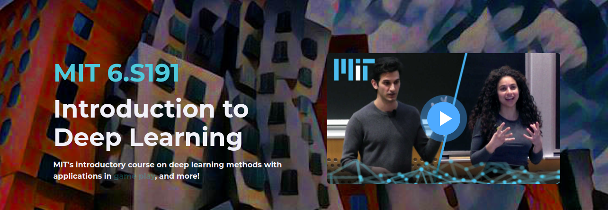
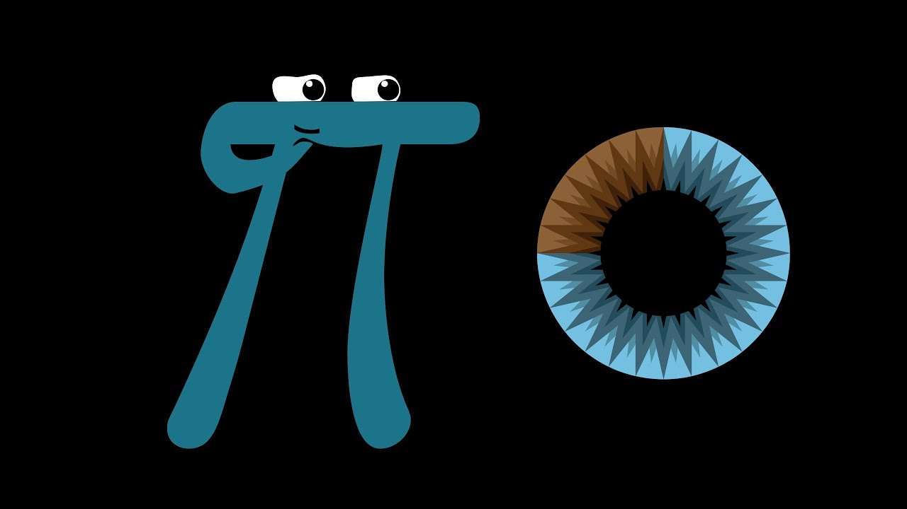

<h1>
  Pytorch ve Derin Öğrenme Odaklı 3 Aylık Program
</h1>

### Python:

- https://nbviewer.org/github/jakevdp/WhirlwindTourOfPython/blob/master/Index.ipynb

### Coursera:

- https://www.coursera.org/specializations/deep-learning

- https://github.com/ashishpatel26/Andrew-NG-Notes

### Derin Öğrenme Kitap/Blog:

- https://campus.datacamp.com/courses/introduction-to-deep-learning-with-pytorch/

- https://duchesnay.github.io/pystatsml/index.html

- https://d2l.ai/index.html

- https://cs231n.github.io/
-

### Youtube-Derin Öğrenme:

- https://www.youtube.com/watch?v=jGwO_UgTS7I&list=PLoROMvodv4rMiGQp3WXShtMGgzqpfVfbU

- https://www.youtube.com/playlist?list=PLZHQObOWTQDNU6R1_67000Dx_ZCJB-3pi

- https://www.youtube.com/watch?v=5tvmMX8r_OM&list=PLtBw6njQRU-rwp5__7C0oIVt26ZgjG9NI

- https://www.youtube.com/watch?v=vT1JzLTH4G4&list=PL3FW7Lu3i5JvHM8ljYj-zLfQRF3EO8sYv

### Youtube-Matematik:

- https://www.youtube.com/watch?v=WUvTyaaNkzM

- https://www.youtube.com/watch?v=1uW3qMFA9Ho&list=PLUl4u3cNGP60hI9ATjSFgLZpbNJ7myAg6

- https://www.youtube.com/playlist?list=PLZHQObOWTQDPD3MizzM2xVFitgF8hE_ab

### İngilizce-Kelime:

- https://coursebender.com/files/ingilizce-turkce-kelime-listesi.pdf

